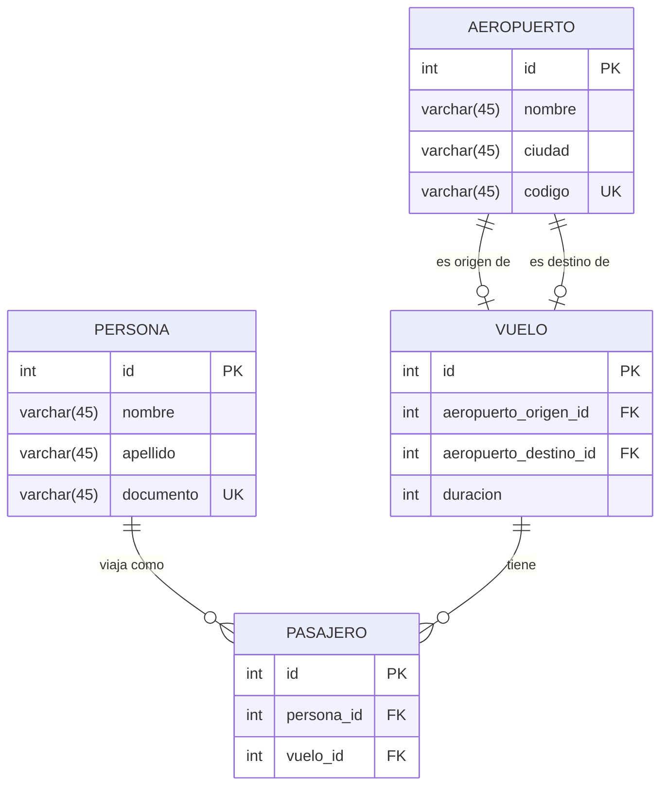

# Project Title

## ER Diagram Code

# Diccionario de Datos

## Tabla: PERSONA
| Campo     | Tipo de Dato  | Restricciones         | Descripción                                           |
|-----------|---------------|-----------------------|-------------------------------------------------------|
| id        | INT           | PK, NOT NULL          | Identificador único para cada persona.                |
| nombre    | VARCHAR(45)   | NOT NULL              | Nombre de la persona.                                 |
| apellido  | VARCHAR(45)   | NOT NULL              | Apellido de la persona.                               |
| documento | VARCHAR(45)   | UNIQUE, NOT NULL      | Documento de identidad único de la persona.           |

## Tabla: PASAJERO
| Campo       | Tipo de Dato  | Restricciones         | Descripción                                                    |
|-------------|---------------|-----------------------|----------------------------------------------------------------|
| id          | INT           | PK, NOT NULL          | Identificador único para cada registro de pasajero.            |
| persona_id  | INT           | FK, NOT NULL          | Identificador de la persona (relación con la tabla PERSONA).   |
| vuelo_id    | INT           | FK, NOT NULL          | Identificador del vuelo (relación con la tabla VUELO).         |

## Tabla: VUELO
| Campo                 | Tipo de Dato  | Restricciones         | Descripción                                                        |
|-----------------------|---------------|-----------------------|--------------------------------------------------------------------|
| id                    | INT           | PK, NOT NULL          | Identificador único para cada vuelo.                               |
| aeropuerto_origen_id  | INT           | FK, NOT NULL          | Identificador del aeropuerto de origen (relación con AEROPUERTO).  |
| aeropuerto_destino_id | INT           | FK, NOT NULL          | Identificador del aeropuerto de destino (relación con AEROPUERTO). |
| duracion              | INT           | NOT NULL              | Duración del vuelo en minutos.                                     |

## Tabla: AEROPUERTO
| Campo     | Tipo de Dato  | Restricciones         | Descripción                                             |
|-----------|---------------|-----------------------|---------------------------------------------------------|
| id        | INT           | PK, NOT NULL          | Identificador único para cada aeropuerto.               |
| nombre    | VARCHAR(45)   | NOT NULL              | Nombre del aeropuerto.                                  |
| ciudad    | VARCHAR(45)   | NOT NULL              | Ciudad donde se encuentra el aeropuerto.                |
| codigo    | VARCHAR(45)   | UNIQUE, NOT NULL      | Código único del aeropuerto (por ejemplo, IATA).        |

    

    
